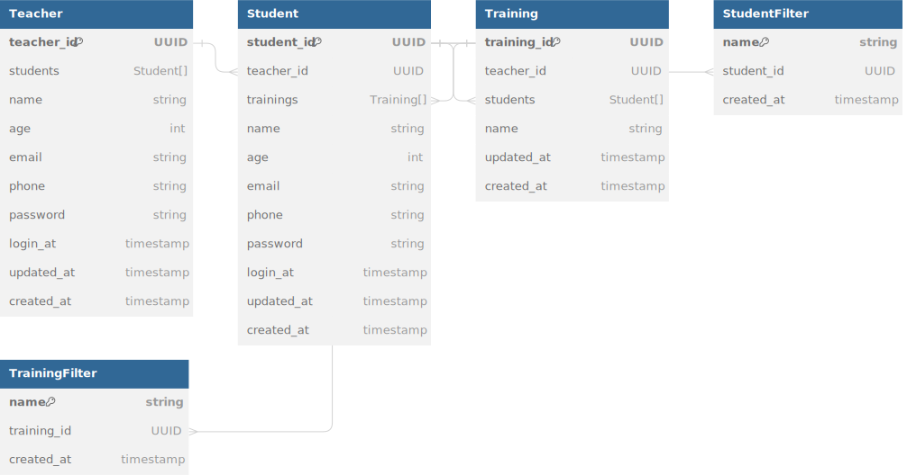

# Academy

## This API was made with JAVA SPRING BOOT.

## Diagram

## Business rule
   
The application manages information about teachers, students and training, with the following business rules:

- **Teacher-Student Relationship:**
  - The `Teacher` table represents teachers.
  - Each teacher is uniquely identified by a `teacher_id`.
  - The `Student` table represents the students.
  - The relationship between teachers and students is established by the foreign key `teacher_id` in `Student`, indicating which teacher is associated with each student.

- **Trainings:**
  - The `Training` table represents training.
  - Each training is uniquely identified by a `training_id`.
  - The relationship between teachers and training is established by the foreign key `teacher_id` in `Training`, indicating which teacher is associated with each training.
  - The relationship between students and training is established by the `students` association table in `Training`, indicating which students are associated with each training.
  - Each student can participate in several trainings, and each training can have several associated students.

- **Student and Training Filters:**
  - The `StudentFilter` table is used to store filters associated with students.
  - Each filter is identified by its unique name (`name`) and is related to a specific student through the foreign key `student_id`.
  - The `TrainingFilter` table is used to store filters associated with training.
  - Each filter is identified by its unique name (`name`) and is related to a specific training through the foreign key `training_id`.

- **Dates and Times:**
  - The `login_at`, `updated_at`, and `created_at` columns in all tables are used to track date and time information related to logging in, updating, and creating records.

- **Relationship between Filters and Records:**
  - The filters (`StudentFilter` and `TrainingFilter`) are directly related to the corresponding records (students and training) through the foreign keys `student_id` and `training_id`, respectively.